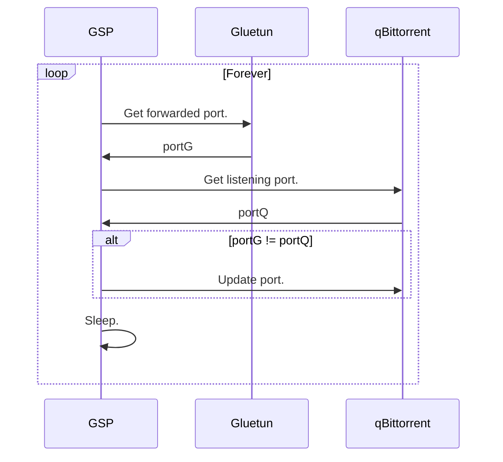

# (Q)GSP : Qbittorrent - Gluetun Synchronised Port mod
A mod to sync forwarded ports from Gluetun to qBittorrent.
This mod is to be used with [linuxserver/qbittorrent container](https://github.com/linuxserver/docker-qbittorrent) and [qdm12/gluetun container](https://github.com/qdm12/gluetun).

**HOWEVER** if you don't use Linuxserver's image, you can run this as a **[standalone container](#install-as-a-standalone-container)**.

> :star: 
> If you like this mod, don't hesitate to give it a star ! It's always nice :)


> :warning: **Be aware !**
> I'm not a developer. I just needed something and found a way to do it. This is my first Linuxserver mod and my first attempt at creating anything with Docker. Also my first use of GitHub Actions, so everything is probably far from perfect. If you have suggestions, feel free to open an issue.


## Operating principle

This mod will call Gluetun API to get the current forwarded port, qBittorrent's API to get the currently configured port, and in case those two ports don't match, update qBittorrent's port.

Here is a very simplified representation of the mod's behaviour :



## Prerequisites

The mod will need to connect to Gluetun's & qBittorrent's API. Here are the prerequisites to grant access.

### qBittorrent

- You will need to enable `Bypass authentication for clients on localhost` inside qBittorrent's `settings` > `Web UI`. Otherwise you can set the `GSP_QBT_USERNAME` and `GSP_QBT_PASSWORD` (or `GSP_QBT_PASSWORD_FILE`) variables.
- If you have enabled the `Enable Host header validation` option, you will need to add `localhost` (or the hostname declared in `GSP_GTN_ADDR`) to the `Server domains` list.

### Gluetun

Since Gluetun 3.40, the API (called `Control server`, more details [here](https://github.com/qdm12/gluetun-wiki/blob/main/setup/advanced/control-server.md)) is now private and needs authentication.
Users and permissions are declared in the `config.toml` file (More details in Gluetun's documentation [here](https://github.com/qdm12/gluetun-wiki/blob/main/setup/advanced/control-server.md#authentication)).

As the mod is running in a container set with `network_mode: "service:gluetun"`, you don't need to publish Gluetun control server port (8000). The mod is calling the API from inside the container.

However to allow this mod to use it's control server, you will need to declare an API Key to Gluetun.

 - Start by generating an API Key. Any long and complicated string will do, but you can generate it using one of the following commands : 
```bash
# Using GPG
gpg --gen-random --armor 1 50
# Using openssl
openssl rand -base64 50
# Using gluetun's internal program
docker run --rm qmcgaw/gluetun genkey
```

 - Then to grant the mod read access to the forwarded port, add the following lines to Gluetun's `config.toml` file (replace the API Key) :
```toml
[[roles]]
name = "t-anc/GSP-Qbittorent-Gluetun-sync-port-mod"
routes = ["GET /v1/openvpn/portforwarded"]
auth = "apikey"
# This is an example apikey, generate your own.
apikey = "yOdKVNFEA3/BSIWhPZohxppHd9I6bHiSJ+FasGlncleveW4LvuO7ONy5w1IsEA2Pu6s="
```


- Finally, pass this key to the mod via the `GSP_GTN_API_KEY` env variable. You can take a look at the [compose example](#docker-compose-example) if needed.

With this setup every time the mod calls Gluetun, it authenticates with the content of `GSP_GTN_API_KEY` so gluetun can check if it matches the key declared in the `config.toml` file.

## Install as a mod (lsio qBittorrent image)

Follow the instructions [here](https://docs.linuxserver.io/general/container-customization/#docker-mods).
With the following link for the mod `ghcr.io/t-anc/gsp-qbittorent-gluetun-sync-port-mod:main`.

You can configure it using [env variables](#Variables).

In any case, you can take a look at the [compose example](#docker-compose-example) if needed.

## Install as a standalone container (non-lsio qBittorrent image)
<details>

  <summary>Instructions</summary>

If you don't run qBittorrent with this image : [linuxserver/qbittorrent](https://github.com/linuxserver/docker-qbittorrent), then you need to follow these instructions.

This repo contains only a mod, not a Docker image. To use this mod as a standalone container, we will apply it to a light linuxserver image to act as a base. In this example we will use the `ghcr.io/linuxserver/baseimage-alpine:edge` image as it's only 27Mo and contains every dependencies we need.

Add this to your compose file :

```yml
GSP_qbt_gtn_sync_port:
  image: ghcr.io/linuxserver/baseimage-alpine:edge
  container_name: GSP_qbt_gtn_sync_port
  environment:
      - DOCKER_MODS=ghcr.io/t-anc/gsp-qbittorent-gluetun-sync-port-mod:main
      # Of course this is an API Key example, don't use this
      - GSP_GTN_API_KEY=yOdKVNFEA3/BSIWhPZohxppHd9I6bHiSJ
  network_mode: container:gluetun
  depends_on:
      gluetun:
        condition: service_healthy
```

And that's it ! 

It should work just as expected, and so you can configure it as you want with the [env variables](#Variables).
The only difference should be this small message in the logs during init checks :

```
/config/qBittorrent/qBittorrent.conf not found, can't check the The "Bypass authentication for clients on localhost" setting. Running in standalone mode.
```

**PS :** if you open an issue, please mention that you run in standalone mode.

</details>

## Variables

The following env variables can be used to configure the mod (Only `GSP_GTN_API_KEY` is required) :
|      Variable          |      Default value      | Comment                                                                                                  |
|:----------------------:|:-----------------------:|----------------------------------------------------------------------------------------------------------|
| `GSP_GTN_API_KEY`      |                         | Gluetun's API key. See the [install section](#gluetun).                                                  |
| `GSP_GTN_API_KEY_FILE` |                         | Gluetun's API key file (for [docker secret](https://docs.docker.com/compose/use-secrets/) use). This supplants `GSP_GTN_API_KEY`. |
| `GSP_GTN_ADDR`         | `http://localhost:8000` | Gluetun API host address.                                                                                |
| `GSP_QBT_ADDR`         | `http://localhost:8080` | Qbittorrent API host address. If the env variable `WEBUI_PORT` is set, it will be used as default.       |
| `GSP_SLEEP`            |           `60`          | Time between checks in seconds.                                                                          |
| `GSP_RETRY_DELAY`      |           `10`          | Time between retries in case of error (in s).                                                            |
| `GSP_GTN_PORT_INDEX`   |           `1`           | Index of port to use from gluetun. Set to `2` to use the second one, etc. Only if you have multiple ports forwarded.          |
| `GSP_QBT_USERNAME`     |                         | Qbittorrent username.                                                                                    |
| `GSP_QBT_PASSWORD`     |                         | Qbittorrent password.                                                                                    |
| `GSP_QBT_PASSWORD_FILE`|                         | Qbittorrent password file (for [docker secret](https://docs.docker.com/compose/use-secrets/) use). This supplants `GSP_QBT_PASSWORD`. |
| `GSP_SKIP_INIT_CHECKS` |         `false`         | Set to `true` to disable qbt config checks ("Bypass authentication on localhost", etc). Set to `warning`to see check results but continue anyway.|
| `GSP_CERT_CHECK`       |         `true`          | Set to `false` to disable certificate check. (curl's insecure flag)                                      |
| `GSP_MINIMAL_LOGS`     |         `true`          | Set to `false` to enable "Ports did not change." logs.                                                   |
| `GSP_INIT_RETRY_WAIT`  |      `10` (=60s)        | Number of retries to connect to qbittorrent's webUI at startup. Each retry takes 6 seconds. Increase to allow a longer wait at startup.          |
| `GSP_DEBUG`            |         `false`         | Set to `true` to enable mod's `set -x`.<br>:warning: **FOR DEBUG ONLY.**<br>This will show your credentials in the logs.                |

I was planning on implementing the option to use Gluetun's port forwarding file but since it will be [deprecated in v4](https://github.com/qdm12/gluetun-wiki/blob/main/setup/advanced/vpn-port-forwarding.md#native-integrations), I won't.

## Docker compose example
This is just an example for the mod, adapt it to your needs.


```yaml
services:
    gluetun:
        image: qmcgaw/gluetun
        container_name: gluetun
        restart: always
        cap_add:
          - NET_ADMIN
        environment:
          - TZ=Europe/Paris
          - VPN_SERVICE_PROVIDER=custom
          - VPN_TYPE=wireguard
          - VPN_PORT_FORWARDING=on
          - VPN_PORT_FORWARDING_PROVIDER=protonvpn
        volumes:
          - "./config.toml:/gluetun/auth/config.toml:ro"

    qbittorrent:
        image: ghcr.io/linuxserver/qbittorrent
        container_name: qbittorrent
        environment:
          - TZ=Europe/Paris
          - WEBUI_PORT=8080
          - DOCKER_MODS=ghcr.io/t-anc/gsp-qbittorent-gluetun-sync-port-mod:main
          # Of course this is an API Key example, don't use this
          - GSP_GTN_API_KEY=yOdKVNFEA3/BSIWhPZohxppHd9I6bHiSJ+FasGlncleveW4LvuO7ONy5w1IsEA2Pu6s=
          - GSP_MINIMAL_LOGS=false
        volumes:
          - "./qbittorrent/config/:/config"
          - "./qbittorrent/webui/:/webui"
          - "./download:/download"
        network_mode: container:gluetun
        depends_on:
          gluetun:
            condition: service_healthy
        restart: unless-stopped
```

## Troubleshooting

Here are some tips for troubleshooting :

<details>

  <summary>Check the logs.</summary>

The mod's logs are visible in the container's log : 
```bash
docker logs -f qbittorrent
```

It's also possible to look at Gluetun's log :

```bash
docker logs -f gluetun
```

  <details>

  <summary>Qbittorrent docker logs.</summary>

```log
[mod-init] Running Docker Modification Logic
[mod-init] Adding t-anc/gsp-qbittorent-gluetun-sync-port-mod:main to container
[mod-init] Downloading t-anc/gsp-qbittorent-gluetun-sync-port-mod:main from ghcr.io
[mod-init] Installing t-anc/gsp-qbittorent-gluetun-sync-port-mod:main
[mod-init] t-anc/gsp-qbittorent-gluetun-sync-port-mod:main applied to container
[migrations] started
[migrations] no migrations found
usermod: no changes
───────────────────────────────────────

      ██╗     ███████╗██╗ ██████╗
      ██║     ██╔════╝██║██╔═══██╗
      ██║     ███████╗██║██║   ██║
      ██║     ╚════██║██║██║   ██║
      ███████╗███████║██║╚██████╔╝
      ╚══════╝╚══════╝╚═╝ ╚═════╝

   Brought to you by linuxserver.io
───────────────────────────────────────

To support LSIO projects visit:
https://www.linuxserver.io/donate/

───────────────────────────────────────
GID/UID
───────────────────────────────────────

User UID:    1000
User GID:    1000
───────────────────────────────────────

[custom-init] No custom files found, skipping...
+---------------------------------------------------------+
|           Gluetun sync port (GSP) mod loaded            |
+---------------------------------------------------------+
|  Qbittorrent address : http://localhost:8080            |
|  Gluetun address     : http://localhost:8000            |
|  GTN port index      : 1                                |
+---------------------------------------------------------+

04/10/24 01:03:49 [GSP] - Waiting for Qbittorrent WebUI ...
WebUI will be started shortly after internal preparations. Please wait...

******** Information ********
To control qBittorrent, access the WebUI at: http://localhost:8080

Connection to localhost (::1) 8080 port [tcp/http-alt] succeeded!
[ls.io-init] done.
04/10/24 01:03:55 [GSP] - Init checks passed. Listening for a change.
04/10/24 01:03:55 [GSP] - Ports did not change.
04/10/24 01:04:55 [GSP] - Ports changed :
04/10/24 01:04:55 [GSP] -  - Old : 22684
04/10/24 01:04:55 [GSP] -  - New : 38473
04/10/24 01:04:55 [GSP] - Updating qbittorrent port via API ...
04/10/24 01:04:55 [GSP] - Qbittorrent port successfully updated.
04/10/24 01:05:55 [GSP] - Ports did not change.
```

  </details>

To (*drastically*) increase the log level, you can set the `GSP_DEBUG` var to `true`.

  <details>

  <summary>Gluetun docker logs.</summary>

```log
2024-12-29T14:22:53+01:00 INFO [port forwarding] starting
2024-12-29T14:22:53+01:00 INFO [port forwarding] gateway external IPv4 address is 156.71.163.18
2024-12-29T14:22:53+01:00 INFO [port forwarding] port forwarded is 18008
2024-12-29T14:22:53+01:00 INFO [firewall] setting allowed input port 18008 through interface tun0...
2024-12-29T14:22:53+01:00 INFO [port forwarding] writing port file /tmp/gluetun/forwarded_port
2024-12-29T14:22:58+01:00 INFO [http server] 200 GET /portforwarded wrote 15B to [::1]:55008 in 79.707µs
2024-12-29T14:23:58+01:00 INFO [http server] 200 GET /portforwarded wrote 15B to [::1]:43420 in 112.741µs
2024-12-29T14:24:58+01:00 INFO [http server] 200 GET /portforwarded wrote 15B to [::1]:45958 in 88.972µs
```

Explanation :
 - The lines taggued `[port forwarding]` are internal actions related to ... port forwarding. Those are useful to understand what gluetun is doing.
 - The lines taggued `[http server]` are related to gluetun's API. In the example above, you can see that something (here, the mod) is requesting the `/portforwarded` endpoint, every 60 seconds. This DOES NOT indicate a change of forwarded port, only an external request to `GET` the current one.

  </details>
</details>

<details>

  <summary>Check Gluetun's control server and forwarded port.</summary>

If the log indicates `Error retrieving port from Gluetun API.` then try to get the port manually (replace the container's name and `localhost:8000` if needed) :

```bash
 docker exec gluetun wget -q -O- /dev/tty http://localhost:8000/v1/openvpn/portforwarded
```

and you should get this (with your port number) :
```bash
{"port":34981}
```
or something like this if you have multiple ports (you can use `GSP_GTN_PORT_INDEX`) :
```bash
{"ports":[10550,20550,30550]}
```

> If you get `0` it means gluetun's port forwarding is misconfigured.

If you get `0` or an error, then the issue is from your gluetun's configuration, you can get help [on the wiki](https://github.com/qdm12/gluetun-wiki/blob/main/setup/advanced/vpn-port-forwarding.md) or [open an issue](https://github.com/qdm12/gluetun/issues).

**Note :** even with `openvpn` in the URL, this is also valid for Wireguard.

</details>

 
<details>

  <summary>[mod-init] (ERROR) digest could not be fetched from ghcr.io</summary>


  This is due to the fact that at startup, qBittorrent container does not have internet access. Since the container gets the connection from Gluetun, you have to tell Docker to wait for an established VPN connection before starting qBittorrent.

  To do that, simply add the following to your qBittorrent's `docker-compose.yml` file section (according to the [example](#docker-compose-example)) :

```yaml
  depends_on:
    gluetun:
      condition: service_healthy
```

This is thanks to [Gluetun's healthcheck](https://github.com/qdm12/gluetun-wiki/blob/main/faq/healthcheck.md) being healthy only when the connection is set.

</details>

<details>

  <summary>Issues with HTTPS.</summary>

There are 2 main issues with HTTPS :
 - Your certificate is not trusted by the container (ex : self signed).
 
    To remediate this, you can use the `GSP_CERT_CHECK` variable and set it to `false`. This will use the `insecure` flag for every `curl` request.
 - Your certificate is trusted, but does not contain `localhost` (obviously) and so the connection is refused.
  
    For this one, you can check [Unspec7's guide](#14) (Thanks to him).

</details>
